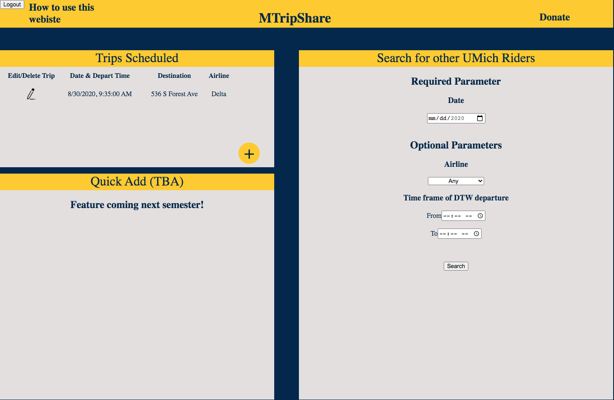

# MTripShare

This project aims to provide a platform for University of Michigan students to find other students heading from the airport to Ann Arbor. 

## Table of Contents
1. Motivation Behind this Project
2. Getting Started with the Platform

## Motivation Behind this Project
Every semester, at the beginning and end, I see fragmented, independent google sheets frantically being started in different organizations to track students' flight logistics in hopes of finding a similar match to split the cost of their choice of ride-share.

I wanted to join the UM communities and find a make a global database of trip logistics so that students can connect with other students outside of their direct network. This would increase accessibility to split ride-shares leading to an increase in cost savings for students.

## Getting Started with the Platform

After making an account, the user will be greeted with a dashboard where they should log their trip logistics and use the search filters to find other UM riders.

## 0. Dashboard 

The landing dashboard is a one shot view of their scheduled trips (top left), mate finder (right half), and quick add (bottom left tba). 

## 1. Scheduling a Trip

After clicking on the '+' button in the trip schedule portion (top left) in the dashboard, the user will be greeted with a pop up modal where they will fill out their trip information which is then stored in the database.

## 2. Finding Trip Mates

After logging their trip, users can look for other UM students via the navigation feature on the right hand side of the dashboard. Here there is a required day they are looking for and additional optional parameters to better pinpoiint their needs (airlines, time frame of departure, etc).

## 3. Viewing Results

![] (images/Search%20Results.png)

After entering their search criteria filters, users will be met with a results page where it will show all matching trips. From there depending on the results, a user can use the uniqname of matching trips to reach out to students via email, or click 'Edit Search Criteria' to expand or narrow the search results.